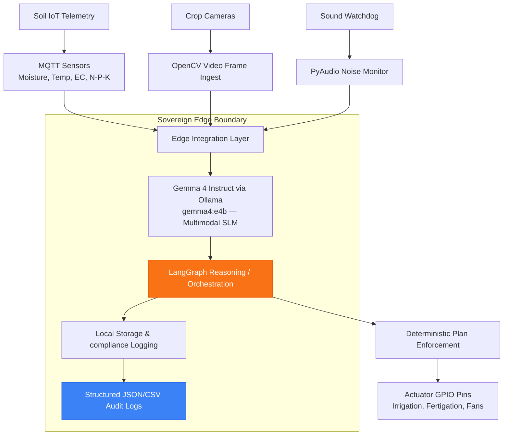
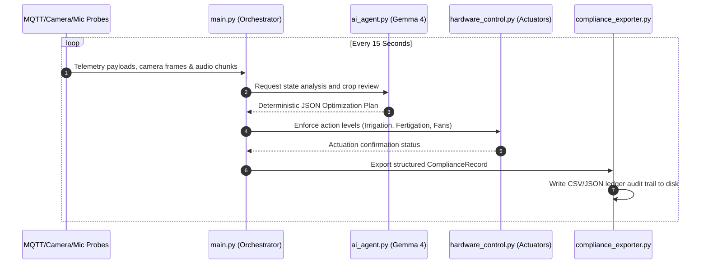

# SoilGaurd Portal System Architecture

SoilGaurd Portal is an edge-native soil quality and agricultural monitoring system designed for full offline operation in New Zealand's remote farm environments.

---

## 1. System Topology

---

## 2. Core Subsystems

### Ingestion Layer (`portal_core/mqtt_client.py`)
* Operates an asynchronous Paho MQTT subscriber loop.
* Ingests local agricultural soil probes tracking Volumetric Water Content (`%VWC`), Temperature (`°C`), Salinity/EC (`dS/m`), and dry-soil Nitrogen/Phosphorus/Potassium (`mg/kg`).

### Sensor Capture Layer (`portal_core/av_capture.py`)
* Captures high-resolution video frames of crop foliage using local USB/CSI cameras (allowing visual assessment of leaf chlorosis or nutrient deficiencies).
* Ingests acoustic signals from farm machinery or water irrigation pumps to identify mechanical leaks or cavitation anomalies.

### Edge Inference Layer (`portal_core/ai_agent.py`)
* Connects to local Ollama server executing the optimized `gemma4:e4b` model (Google's Gemma 4 4B Instruct model).
* Leverages multimodal capabilities to reason over both telemetry metrics and camera frames.
* Evaluates prompts against input safety guards (`input_guard_check` from `coastal-alpine-core`) to block malicious patterns or prompt injections.

### Actuator Control Layer (`portal_core/hardware_control.py`)
* Translates plan commands to GPIO BCM pins:
  * **Irrigation (Valves/Pumps):** PWM duty cycle control representing low/medium/high/off states.
  * **Nutrient Fertigation Relays:** Fertigation injection pump controls.
  * **Ventilation/Circulation Fans:** Ventilation fan relays for crop aeration.
* Safely runs in mock simulation mode when physical hardware interfaces are unavailable.

### Auditing & Exporter Layer (`portal_core/compliance_exporter.py`)
* Writes detailed, hourly audit events as standalone JSON records.
* Appends summary data to `compliance_ledger_CONSENT-XXX.csv` conforming to Waikato Regional Council permitted activity guidelines.
* Working directory disk space is protected by `portal_core/media_pruner.py` which cleans old frames/audio while preserving all CSV/JSON compliance records.

---

## 3. Data Flow Sequencing

