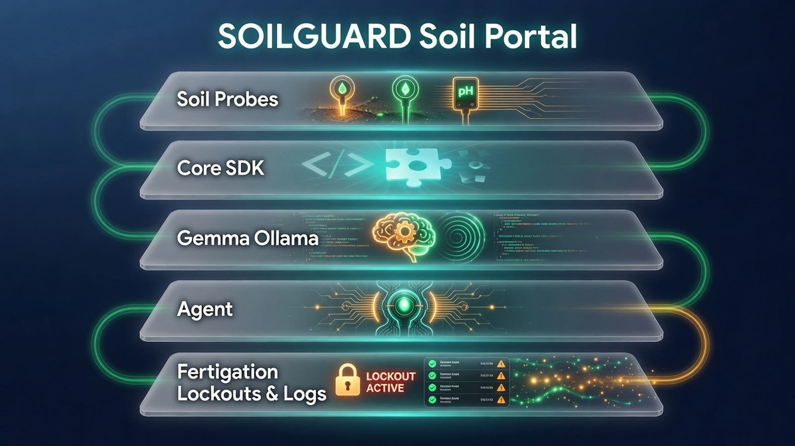
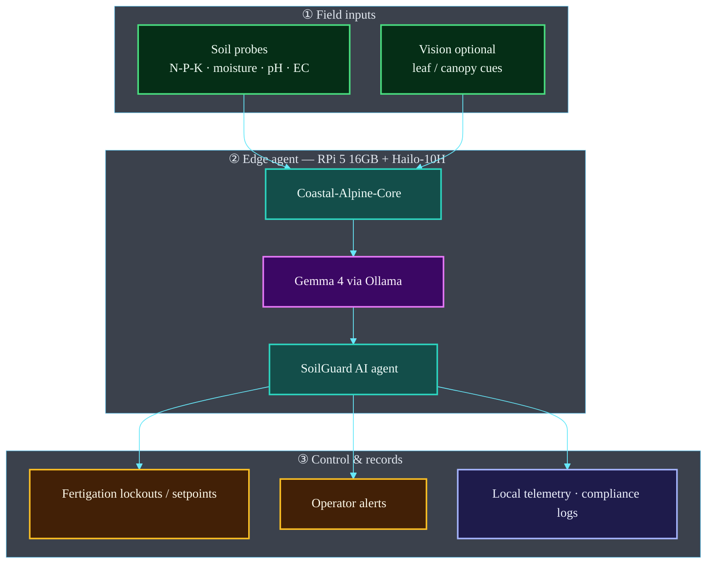

# SoilGuard Portal: Soil Quality & Agricultural Monitor


**Coastal Alpine Tech Limited**  
*Edge AI | Sovereign Systems | Practical Intelligence*


Autonomous on-premise soil quality monitoring and agricultural control system for New Zealand dairy farms, glasshouses, and orchards. Powered by local edge AI, it runs fully offline in remote and regulated rural catchments to maintain data sovereignty.

---

## Architecture Overview

SoilGuard monitors soil health and fertigation on-device. Sensor streams and optional vision feed **Gemma 4 via Ollama** on **RPi 5 16GB + Hailo-10H**, with actuator lockouts for regulatory safety.



### System map



| Layer | Components | Role |
| :--- | :--- | :--- |
| **Sensors** | N-P-K · moisture · pH · EC | On-paddock soil truth |
| **Agent** | Gemma 4 + Core SDK | Offline decisions |
| **Safety** | Fertigation lockouts | NES-F / regional rules |
| **Hardware** | RPi 5 16GB + Hailo-10H | Canonical edge target |

*Full detail: [ARCHITECTURE.md](./ARCHITECTURE.md)*


## The 5 Ws: Project Context

* **Who:** Developed by Coastal Alpine Tech Limited in partnership with Taranaki and Waikato crop growers, dairy farmers, and iwi trusts.
* **What:** An edge-native IoT monitor and agentic control system that ingests soil telemetry (moisture, temperature, EC, N-P-K), visual leaf health cues, and acoustic diagnostics to optimize crop yield and generate council-ready environmental audits.
* **Where:** Deployed on-premise at nurseries, glasshouses, orchards, and pastoral runoff sites across New Zealand. HQ in New Plymouth, Taranaki.
* **When:** Active development as of June 2026.
* **Why:** Synthetic nitrogen fertilizer caps and Freshwater Farm Plan rules require farm operators to strictly manage soil runoffs and leaching. SoilGuard provides on-device data logging and localized automation without relying on vulnerable, non-sovereign cloud services.

---

## The Problem We Are Solving

1. **Cloud Blackouts in Rural NZ** — Remote farms and high-country stations regularly experience cell tower and internet drops, which makes cloud-based agritech platforms unreliable for daily irrigation and compliance data logging.
2. **Strict Nitrate Application Caps** — The National Environmental Standards for Freshwater (NES-F 2020) limits synthetic nitrogen fertilizer application to **190 kg N/ha/year**. Exceeding this limit leads to substantial fines.
3. **Erosion & Silt Runoff** — Over-irrigation on clay or silty soils induces soil erosion and carries fertilizer runoff into local rivers, causing a breach of regional permitted activity consents (e.g. Waikato Rule 3.5.5.1).
4. **Customary Data Rights** — Māori landowners and iwi trusts managing ancestral *whenua* demand that environmental and production telemetry remain under local custody (respecting *Te Mana Raraunga* or Māori Data Sovereignty network principles).

---

## Key Features

* **Multi-Modal Soil Ingestion:** Real-time processing of moisture (%VWC), temperature, electrical conductivity, and dry-soil N-P-K nutrients via MQTT gateways.
* **Leaf Quality Inspection:** Local USB/CSI camera frame capture processed via local Gemma 4 multimodal vision prompts to identify signs of crop chlorosis, pest incursions, or drying.
* **Acoustic Diagnostic Watchdog:** Mic capture loop listening for irrigation equipment anomalies or valve blockages.
* **Google Gemma 4 (`gemma4:e4b`):** Edge-quantized multimodal large language model executing offline on RPi 5 to assess conditions and issue control commands.
* **Automated Actuation:** GPIO/PWM control loops for solenoid irrigation valves, nutrient fertigation pumps, and ventilation fans.
* **Council-Ready Audits:** Instant export of CSV ledgers and JSON traces matching Waikato and Horizons regional reporting specifications.
* **Media Disk Protection:** Active storage capacity management via media pruner that cleans old transient images/audio while preserving all compliance records.

---

## Directory Structure

```bash
SoilGuard-Portal/
├── portal_schemas/           # Pydantic schemas (compliance, readings, plans)
├── portal_core/              # Core modules (config, mqtt, av, hardware, pruner)
├── telemetry_data/           # Local ledger dumps and transient media buffers
├── tests/                    # Unit and security stress test files
├── main.py                   # Unattended orchestrator entrypoint
├── validate.py               # diagnostics boot sequences
├── setup.py                  # pip installation setup script
├── soilguard.service         # Systemd service unit template
├── requirements.txt          # Production package requirements
├── requirements-dev.txt      # Unit test requirements
├── .env.example              # Local configuration template
├── ARCHITECTURE.md           # Mermaid sequence flows and layout mapping
├── COMPLIANCE.md             # NZ Legislative mapping details
└── README.md                 # Project user documentation
```

---

## Quick Start

### Hardware Prerequisites

* **Raspberry Pi 5 (16GB RAM)** — Available locally via PB Tech or Kiwi Electronics.
* **Raspberry Pi AI Accelerator / AI HAT+ 2** (40 TOPS, Hailo-10H NPU) — Key for offline generative AI workloads.
* **Soil Probes & ESP32 gateway** — Telemetry sensors broadcasting over MQTT.
* **USB/CSI Camera** — Installed above crop canopy in IP67 enclosure.

### Installation & Setup

We provide separate guides for system environment setup and installation for Windows and Linux users:

* **Prerequisites & System Setup Guide**: Read [setup.md](setup.md)
* **Installation Guide**: Read [installation.md](installation.md)

### Quick Start (Automated Setup)
The fastest way to install is running the cross-platform bootstrap script:

```bash
python bootstrap.py
```

d-Portal
python bootstrap.py
```

### Manual Installation & Run

1. **Clone the Portal Repository:**

   ```bash
   git clone https://github.com/fivepanelhat/SoilGuard-Portal.git
   cd SoilGuard-Portal
   ```

2. **Configure Virtual Environment:**

<details open>
<summary><strong>🐧 Linux / macOS (Bash)</strong></summary>

```bash
python3 -m venv venv
source venv/bin/activate
pip install git+https://github.com/fivepanelhat/coastal-alpine-core.git@v0.2.0
pip install -r requirements.txt -r requirements-dev.txt
cp .env.example .env
```

</details>

<details>
<summary><strong>🪟 Windows (PowerShell)</strong></summary>

```powershell
python -m venv venv
.\venv\Scripts\Activate.ps1
pip install git+https://github.com/fivepanelhat/coastal-alpine-core.git@v0.2.0
pip install -r requirements.txt -r requirements-dev.txt
Copy-Item .env.example .env
```

> **Note:** If you receive an execution policy error, run `Set-ExecutionPolicy -Scope CurrentUser RemoteSigned` first.

</details>

3. **Deploy Gemma 4 Model:**

   ```bash
   ollama serve
   ollama pull gemma4:e4b
   ```

4. **Verify System Setup:**

   ```bash
   python validate.py
   ```

5. **Start Orchestrator Daemon:**

   ```bash
   python main.py
   ```

---

## Performance & Benchmarks

* **Local Inference Latency:** ~0.85 seconds per query running Google's `gemma4:e4b` on Raspberry Pi 5.
* **Energy Consumption:** Peak active NPU execution draw is ~1.5W, enabling solar-powered off-grid deployment.
* **Storage Footprint:** media pruner limits raw camera frame buffer size below 500MB, retaining compliance records for 7+ years in compressed format.

---

**Built for New Zealand — data sovereign, edge-native, compliance-aware.**  
Questions or collaboration? Contact Coastal Alpine Tech Limited, New Plymouth, Taranaki.

---

## Project badges

Status badges for this repository (CI, security, license, and stack metadata):

[](LICENSE)  
[](https://www.python.org/)  
[]()  
[]()  
[]()  
[](https://github.com/fivepanelhat/SoilGuard-Portal/actions/workflows/ci-scan.yml)  
[](https://github.com/fivepanelhat/SoilGuard-Portal/actions/workflows/secops.yml)  
[](https://github.com/fivepanelhat/SoilGuard-Portal/actions/workflows/redteam.yml)  
[]()  
[]()  
[]()
